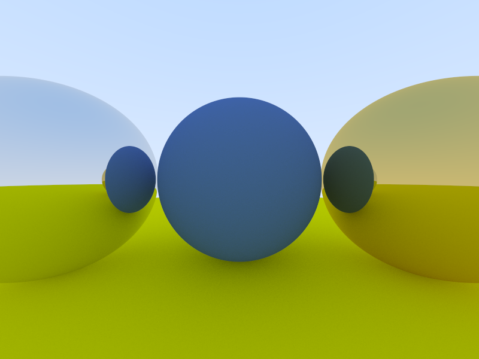

# rachit-pt
A toy rendering engine written Rust. Generates beautiful images of 3D scenes with path tracing.

# Planned Features
- A multithreaded progressive rendering system
- A Phong bidirectional reflectance distribution function (BRDF) Model for physically-based rendering
- HDR skybox support with sRGB gamma correction ✅
- Depth of field ✅ (kinda, working on a weird bug)
- Bounding box acceleration structures
- Support for triangle meshes / GLTF and OBJ Model loading
- Texture and normal map support

# Low-Priority Future Improvements
- Disney BSDF support

# Sources
'Ray Tracing in One Weekend' by Pete Shirly https://raytracing.github.io/

'An Anisotropic Phong BRDF Model' by Michael Ashikhmin and Peter Shirley https://www.cs.utah.edu/~shirley/papers/jgtbrdf.pdf